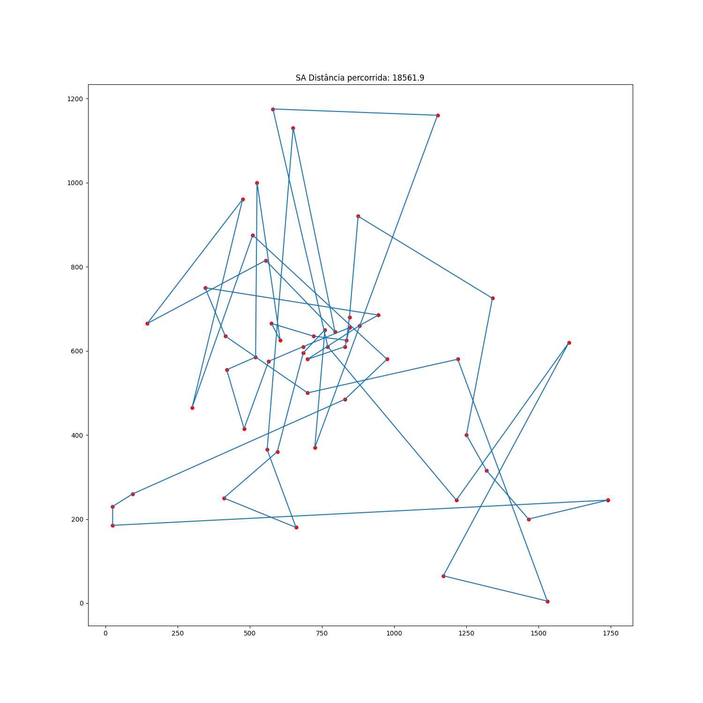
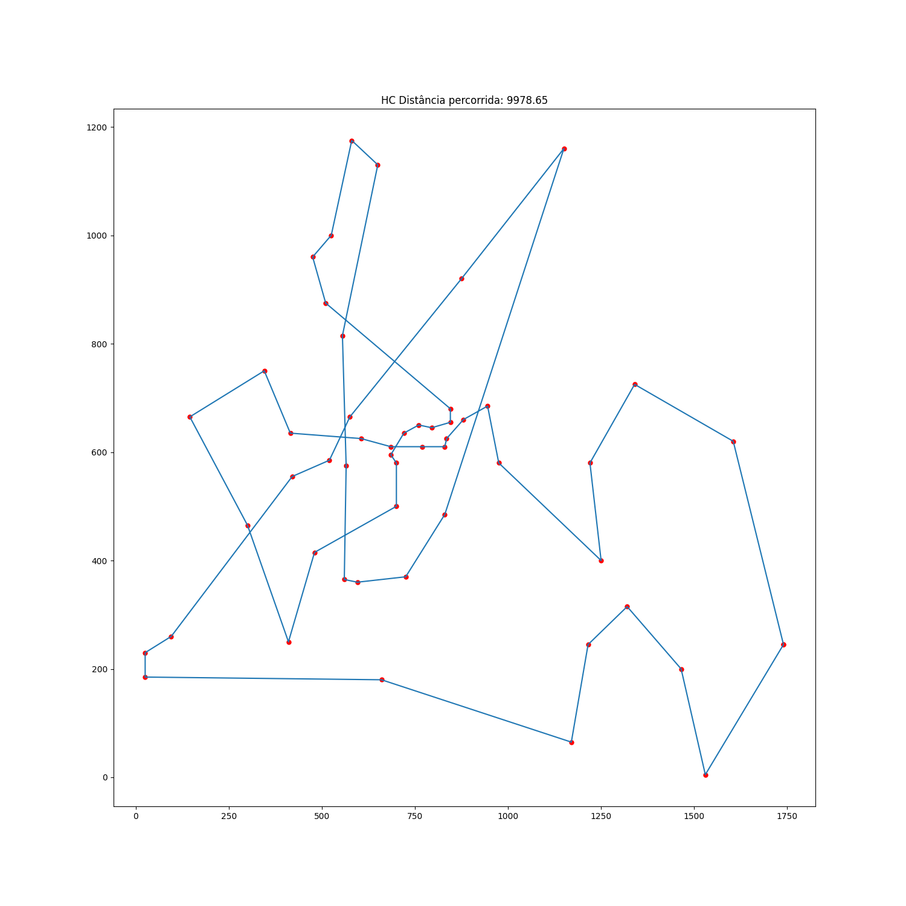

# Trabalho-IMPLEX

### Descrição
TSP, o problema do caixeiro viajante (do inglês, Travelling Salesman Problem), 
é um conhecido problema na área de computação. O problema em questão tem por objetivo 
ajudar a encontrar, dentre uma quantidade finita de locais, qual o menor caminho 
possível que se pode percorrer para que o caixeiro atinga todas as localidades 
retornando sempre ao seu ponto de origem. O problema é característico por 
ser um NP-completo. Utilizando as metaheurísticas Hill Climbing e 
Simulated Annealing, buscamos achar a solução mais próxima do ótimo global.

### Instruções de execução
O trabalho foi feito utilizando a linguagem Python, na versão 3.9, portanto, 
é necessário instalar o interpretador Python.

Inicialmente, instale as dependências executando o seguinte comando no terminal:

```
pip install -r requirements.txt
```
São fornecidas 2 formas de execução:
- Através de uma aplicação web
  <br>
  Abra o terminal no diretório raiz e execute o seguinte comando:
  ```
  streamlit run app.py
  ```
  No lado esquerdo, selecione a metaheurística e o caso de teste desejado.
  
  Ao selecionar uma metaheurística, os dados necessários serão solicitados.
 
  Após fornecer os dados, aperte 'Executar', e veja o resultado.
  

- Através do terminal
  <br>
  Abra o terminal no diretório raiz e execute o seguinte comando:
  ```
  python run.py
  ```
  Depois disso, basta fornecer os dados conforme forem solicitados via linha de comando
  

### Resultado do Simulated Annealing em um dos casos de teste


### Resultado do Hill Climbing em um dos casos de teste

